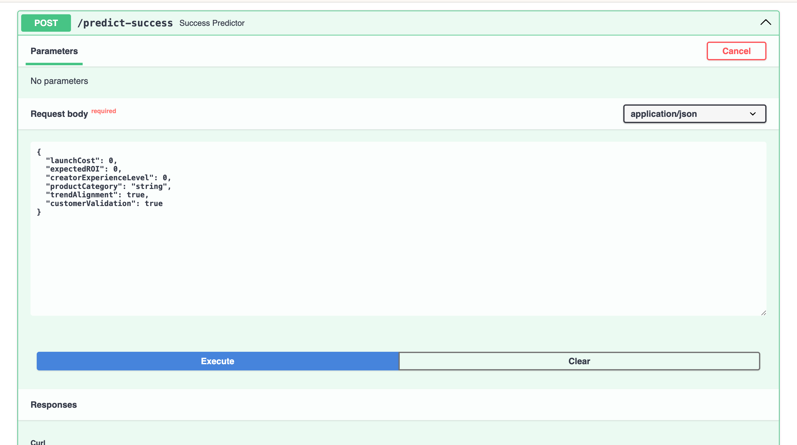
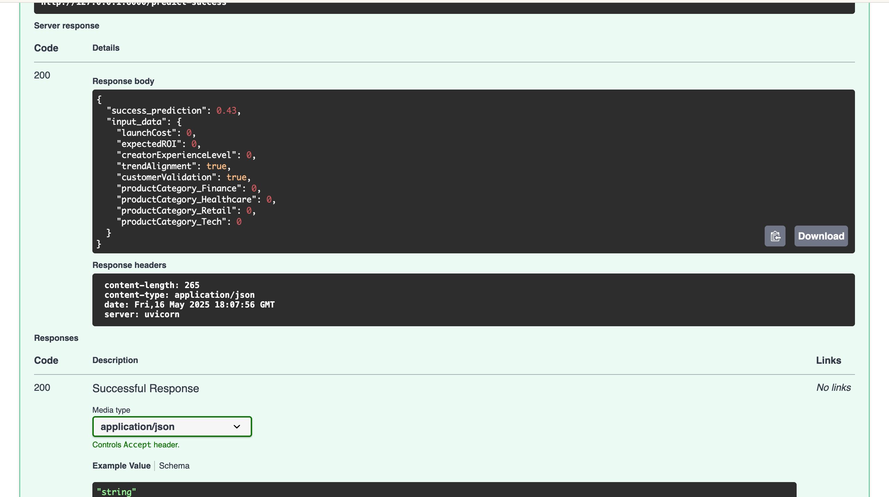
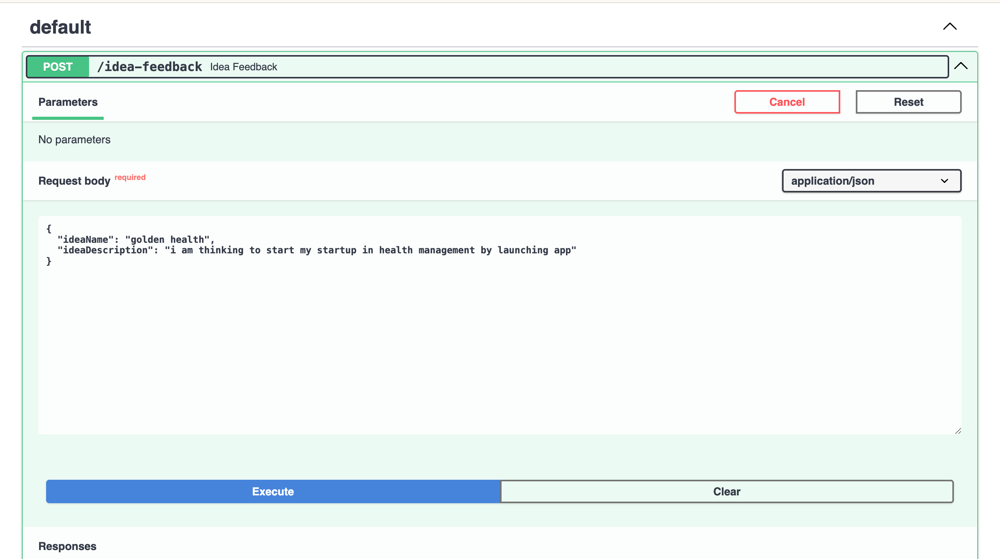
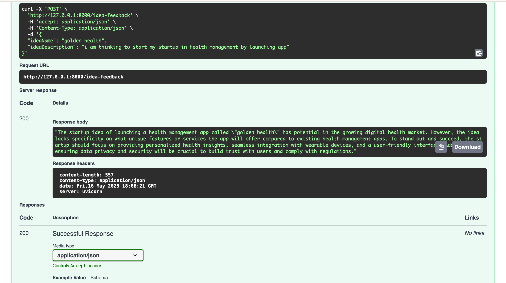

🧠 Smart Product Launch Dashboard – ML API

This is a Machine Learning-powered API service built with FastAPI that predicts the success of a product idea based on factors like cost, expected ROI, experience level, and strategic validation.

It is connected to a full-stack dashboard and deployed on AWS EC2 via Docker + GitHub Actions.

🔗 Live Project

🚀 Server listens on

[https://smart-product-launch-ml-469045769318.europe-west3.run.app/docs](https://smart-product-launch-ml-469045769318.europe-west3.run.app/docs) 

🚀 Features

📊 Predict product success using a trained Random Forest model

📬 /predict-success endpoint receives idea input and returns the success %

🧠 /idea-feedback endpoint uses GPT to give human-readable strategic feedback (via OpenAI)

🛠️ Deployed via Docker and Google Cloud Run

🔎 Swagger UI documentation available at /docs

🧠 ML Model Overview

Algorithm: Random Forest Classifier (after evaluating Logistic Regression)

Dataset: Synthetic product idea submissions (100 records)

Features used:

launchCost, expectedROI, creatorExperienceLevel

customerValidation, trendAlignment

One-hot encoded: productCategory

📦 API Endpoints

POST /predict-success

Takes a product idea input and returns a success prediction (0/1) and probability.

{
  "launchCost": 15000,
  "expectedROI": 1.8,
  "creatorExperienceLevel": 2,
  "trendAlignment": true,
  "customerValidation": true,
  "productCategory": "Tech"
}

Returns:

{
  ""success_prediction": 0.43,
  "input_data": {...}
}

POST /idea-feedback

Uses OpenAI to return a GPT-generated explanation for a given idea.

{
  "ideaName": "Voice-based CRM Tool",
  "ideaDescription": "A hands-free sales CRM powered by voice commands..."
}

Returns plain English analysis like:

"This idea shows promise due to the rising adoption of voice AI... However, the CRM market is saturated..."

🐻 Dockerized & Ready for CI/CD

This project is containerized using a Dockerfile and deployed directly to Google Cloud Run using the Cloud Console UI.

✅ Libraries installed during build step✅ .env handled securely using GitHub Secrets

## 📸 Project Preview

### predict success API request (swagger UI)

### predict success API response (swagger UI)

### idea feedback API request (swagger UI)

### idea feedback API request (swagger UI)

📁 Folder Structure

├── models/                  # Trained .pkl models
├── main.py                 # FastAPI app
├── requirements.txt
├── Dockerfile
├── .gitignore
├── .env (ignored)
└── eda_product_ideas.ipynb # EDA + ML training notebook

🔐 Secrets / API Keys

OPENAI_API_KEY=sk-xxxx...

This is provided as a environment variable passed through github secrets to docker container where this app runs

👨‍💼 Author

Created by Shaik Muffazzalin Taj
email: muffassalinshaik@gmail.com